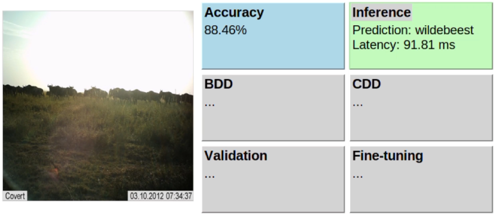

# WildFit
WildFiT: Autonomous In-situ Model Adaptation for Resource-Constrained IoT Systems

# Click On the image to watch the demo.
Demo Color Code:
- Blue: Accuracy
- Grey Box: Module is inactive
- Orange Box: Module is currently running
- Green Box: Module has completed execution
  
Since some Modules have very low latency, artificial delays were introduced in parts of the code to enhance the visibility of their execution during the demo.

